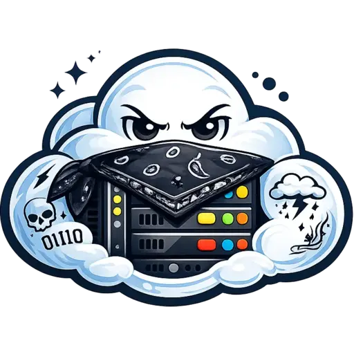

# OgCloud

<p align="center">
  
</p>

<p align="center">
  <strong>:cloud: Kubernetes-native infrastructure for running Minecraft networks.</strong>
</p>

<p align="center">
  <em>:rocket: Provision servers on demand. :globe_with_meridians: Route players intelligently. :hammer_and_wrench: Manage your whole network from one control plane.</em>
</p>

<p align="center">
  
  
  
  
</p>

---

## :brain: What We Are

OgCloud is a Kubernetes-native control plane for Minecraft networks.

It gives you one platform for:

- :globe_with_meridians: network ingress and TCP routing
- :video_game: proxy and backend server lifecycle
- :chart_with_upwards_trend: autoscaling and maintenance workflows
- :package: templates and backing services
- :desktop_computer: dashboard + API operations
- :electric_plug: plugin-level integration APIs

Repository: https://github.com/Jevzo/ogcloud

## :test_tube: Development Status

OgCloud is still actively in development.

Current status: **beta and production-ready** for teams comfortable with Kubernetes operations and iterative releases.

Planned roadmap: support multiple Minecraft versions in a single cluster through protocol-based routing at the load
balancer, with plugin-side translation.

## :bulb: Why OgCloud

- :white_check_mark: Replace hand-maintained server fleets with managed lifecycle automation.
- :white_check_mark: Scale by group rules and player demand, not guesswork.
- :white_check_mark: Keep gameplay plugins connected to live cloud state.
- :white_check_mark: Update API/controller/loadbalancer/dashboard independently.
- :white_check_mark: Use one platform model from local testing to production clusters.

## :sparkles: Feature List

- :wheel_of_dharma: Kubernetes-native architecture for Minecraft workloads
- :compass: Dedicated Minecraft-protocol-aware load balancer
- :robot: Controller-driven autoscaling and server orchestration
- :computer: Dashboard + REST API for network operations
- :card_index_dividers: Template storage and distribution flow
- :mailbox_with_mail: Kafka + Redis + MongoDB integration
- :electric_plug: Paper and Velocity plugin APIs
- :bricks: Helm charts split by concern: infra, platform, dashboard
- :motorway: Planned: multi-version network support (single cluster, protocol-aware routing + plugin translation)

---

## :zap: Quick Install Guide

### :white_check_mark: Prerequisites

- `kubectl` configured for your target cluster
- `helm`
- Node.js 18+ (`npm` / `npx`)

### :rocket: Fastest Path (Recommended)

If you want the easiest setup: this is it.
Spin up the wizard, answer a few prompts, and you are deploying in minutes.

```bash
npx @ogcloud/setup
```

### :compass: Straight Command Path

```bash
npx @ogcloud/setup --generate-config ogwars
npx @ogcloud/setup --deploy ogwars
```

### :toolbox: Common Commands

```bash
npx @ogcloud/setup --generate-config <network>
npx @ogcloud/setup --deploy <network>
npx @ogcloud/setup --deploy <network> --without-backing
npx @ogcloud/setup --update <network> <dashboard|api|loadbalancer|controller> <tag>
npx @ogcloud/setup --destroy <network>
```

### :file_cabinet: Generated Local State

- `~/.ogcloud-setup/state.json`
- `~/.ogcloud-setup/networks/<network>/values.infra.yaml`
- `~/.ogcloud-setup/networks/<network>/values.platform.yaml`
- `~/.ogcloud-setup/networks/<network>/values.dashboard.yaml`

---

## :earth_africa: Public Endpoints

A typical OgCloud deployment exposes:

- `mc.yourserver.io` -> Minecraft ingress through OgCloud load balancer
- `https://api.yourserver.io` -> control-plane API
- `https://dashboard.yourserver.io` -> admin dashboard

---

## :electric_plug: Plugin APIs

OgCloud exposes APIs for both Paper and Velocity plugins.

### Paper Example: Lobby Switcher Using `getPlayerGroup`

This routes players to a different lobby group depending on their resolved permission group.

```kotlin
class LobbyCommand : CommandExecutor {
    override fun onCommand(sender: CommandSender, command: Command, label: String, args: Array<out String>): Boolean {
        val player = sender as? Player ?: return true
        val cloud = OgCloudServerAPI.get()

        val permissionGroup = cloud.getPlayerGroup(player.uniqueId)
        val targetLobbyGroup = if (permissionGroup?.name.equals("staff", ignoreCase = true)) {
            "staff-lobby"
        } else {
            "lobby"
        }

        cloud.transferPlayerToGroup(player.uniqueId, targetLobbyGroup)
            .thenRun { player.sendMessage("Sending you to $targetLobbyGroup...") }
            .exceptionally {
                player.sendMessage("Failed to switch lobby.")
                null
            }

        return true
    }
}
```

### Paper Example: Match Flow + Warm Spare Request

```kotlin
val cloud = OgCloudServerAPI.get()

cloud.setGameState(GameState.INGAME)

cloud.requestServer("minigame").thenAccept { serverInfo ->
    logger.info("Warm spare requested: {} in group {}", serverInfo.id, serverInfo.group)
}
```

### Velocity Example: Route On Join With `getPlayerGroup`

```kotlin
class AutoRouteListener {
    @Subscribe
    fun onJoin(event: PostLoginEvent) {
        val player = event.player
        val cloud = OgCloudProxyAPI.get()

        val playerGroup = cloud.getPlayerGroup(player.uniqueId)
        val destinationGroup = if (playerGroup?.name.equals("vip", ignoreCase = true)) {
            "vip-lobby"
        } else {
            "lobby"
        }

        cloud.transferPlayerToGroup(player.uniqueId, destinationGroup)
            .exceptionally {
                logger.error("Failed to route {} to {}", player.username, destinationGroup, it)
                null
            }
    }
}
```

---

## :sos: Discord And Help

- Community and support: **[OgCloud | Support and Development](https://discord.gg/pE9gCBm822)**
- Source and issues: https://github.com/Jevzo/ogcloud

---

## :heart: Sponsoring

If OgCloud helps your network, sponsoring supports faster development and support capacity.

- [GitHub Sponsors](https://github.com/sponsors/Jevzo)

---

## :hammer_and_wrench: Local Development

From repo root:

```powershell
.\build.ps1 api
.\build.ps1 controller
.\build.ps1 dashboard
```

Docker build + push examples:

```powershell
.\build.ps1 docker api -p
.\build.ps1 docker controller -p
.\build.ps1 docker loadbalancer -p
.\build.ps1 docker dashboard -p
```

---

## :package: Publish `@ogcloud/setup`

```bash
cd helper/ogcloud-setup-cli
npm install
npm run build
npm version patch
npm publish --access public
```

After publish:

```bash
npx @ogcloud/setup
```
